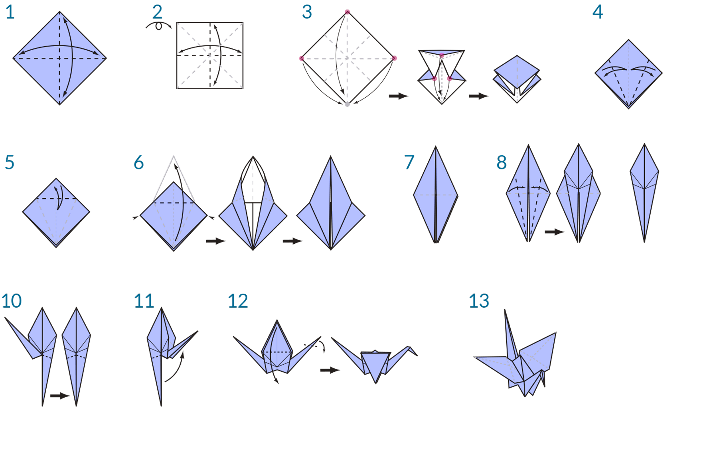

###What is Visual Programming?【可视化编程是什么?】

Designing frequently involves establishing visual, systemic, or geometric relationships between the parts of a design. More times than not, these relationships are developed by workflows that gets us from concept to result by way of rules. Perhaps without knowing it, we are working algorithmically - defining a step-by-step set of actions that follow a basic logic of input, processing, and output. Programming allows us to continue to work this way but by formalizing our algorithms.


设计通常涉及建立视觉、系统性、或几何部分的设计之间的关系。多次使用这些关系是由流线型,让我们从概念到实体的过程。也许在不知道的情况下,我们正在通过算法——定义一套有规律的的基本原理。进行，输入、处理和输出。编程允许我们使用这样形式化算法。


###Algorithms in Hand 【 算法指南 】
While offering some powerful opportunities, the term **Algorithm** can carry some misconceptions with it. Algorithms can generate unexpected, wild, or cool things, but they are not magic. In fact, they are pretty plain, in and of themselves. Let's use a tangible example like an origami crane. We start with a square piece of paper (input), follow a series of folding steps (processing actions), and result in a crane (output).

Dynamo提供一些强大的运算,它可以运载一些错误的算法。算法可以产生意想不到的效果,或者很酷的东西。事实上他们很普通。让我们用一例子来说明一下。像一个纸鹤。我们从一个正方形的纸对折,遵循一系列的折叠步骤(处理行动),最终就形成了纸鹤，在这个过程中，也就是一个算法的过程。


So where is the Algorithm? It is the abstract set of steps, which we can represent in a couple of ways - either textually or graphically.

所以算法是什么，它是抽象的步骤,我们可以在几个方面来表示——数据或图形


**Textual Instructions:**    文本命令 （以下是纸鹤的图形折叠的图）
1. Start with a square piece of
paper, coloured side up. Fold in half and open. Then fold in half the other way.
2. Turn the paper over to the white side. Fold the paper in half, crease well and open, and then fold again in the other direction.
3. Using the creases you have made, Bring the top 3 corners of the model down to the bottom corner. Flatten model.
4. Fold top triangular flaps into the center and unfold.
5. Fold top of model downwards, crease well and unfold.
6. Open the uppermost flap of the model, bringing it upwards and pressing the sides of the model inwards at the same time. Flatten down, creasing well.
7. Turn model over and repeat Steps 4-6 on the other side.
8. Fold top flaps into the center.
9. Repeat on other side.
10. Fold both ‘legs’ of model up, crease very well, then unfold.
11. Inside Reverse Fold the “legs” along the creases you just made.
12. Inside Reverse Fold one side to make a head, then fold down the wings.
13. You now have a crane.

**Graphical Instructions:**   图形指令



###Programming Defined   编程定义
Using either of these sets of instructions should result in a crane, and if you followed along yourself, you've applied an algorithm. The only difference is the way in which we read the formalization of that set of instructions and that leads us to **Programming**. Programming, frequently shortened from *Computer Programming*, is the act of formalizing the processing of a series of actions into an executable program. If we turned the above instructions for a creating crane into a format our computer can read and execute, we are Programming.

使用这些设置的指令命令你就能够做成纸鹤,如果你沿着自己的一个进行操作。唯一的区别是我们得到的指令规范化编程，在编程中缩短计算机一系列行为或处理的一个可执行程序。如果我们把上面的创建纸鹤指令形式输入电脑并执行的这么一个过程。也可以简单理解为算法。

The key to and first hurdle we will find in Programming, is that we have to rely on some form of abstraction to communicate effectively with our computer. That takes the form of any number of Programming Languages, such as Javascript, Python, or C. If we can write out a repeatable set of instructions, like for the origami crane, we only need to translate it for the computer. We are on our way to having the computer be able to make a crane or even a multitude of different cranes where each one varies slightly. This is the power of Programming - the computer will repeatedly execute whatever task, or set of tasks, we assign to it, without delay and without human error.

我们会发现在程序设计中,必须依靠电脑某种有效形式进行沟通。采用各种形式的编程语言,如Javascript、Python或c。如果能写出一组可重复的指令,就像纸鹤,我们只需要把它翻译为计算机语言，让计算机能够制作出纸鹤，甚至多种不同的纸鹤,这就是编程的能力,它将重复执行任何任务或一组任务,我们分配给它制作，没有人为的错误。


####Visual Programming Defined
>Download the example file that accompanies this exercise (Right click and "Save Link As..."): [Visual Programming - Circle Through Point.dyn](datasets/1-1/Visual Programming - Circle Through Point.dyn). A full list of example files can be found in the Appendix.

If you were tasked with writing instructions for folding an origami crane, how would you go about it? Would you make them with graphics, text, or some combination of the two?

If your answer contained graphics, then **Visual Programming** is definitely for you. The process is essentially the same for both Programming and Visual Programming. They utilize the same framework of formalization; however, we define the instructions and relationships of our program through a graphical (or "Visual") user interface. Instead of typing text bound by syntax, we connect pre-packaged nodes together. Here's a comparison of the same algorithm - "draw a circle through a point" - programmed with nodes versus code:

**Visual Program:**


**Textual Program:**
```
myPoint = Point.ByCoordinates(0.0,0.0,0.0);
x = 5.6;
y = 11.5;
attractorPoint = Point.ByCoordinates(x,y,0.0);
dist = myPoint.DistanceTo(attractorPoint);
myCircle = Circle.ByCenterPointRadius(myPoint,dist);
```
The results of our algorithm:


The visual characteristic to programming in such a way lowers the barrier to entry and frequently speaks to designers. Dynamo falls in the Visual Programming paradigm, but as we will see later, we can still use textual programming in the application as well.


视觉特征到编程的方式降低了门槛,经常与设计师。发电机在视觉编程范式,但我们会看到之后,我们仍然可以在应用程序中使用文本编程。

