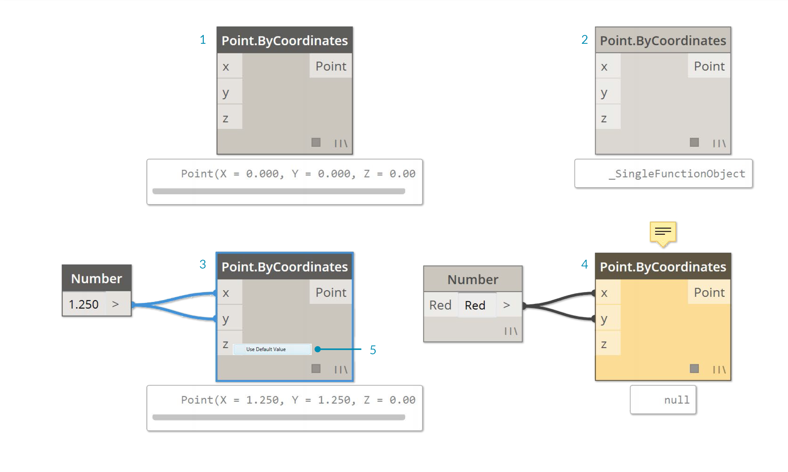

##NODES
## 节点

In Dynamo, **Nodes** are the objects you connect to form a Visual Program. Each **Node** performs an operation - sometimes that may be as simple as storing a number or it may be a more complex action such as creating or querying geometry.

在Dynamo中“节点”，节点对象连接到一起，形成一个视觉程序，每个节点执行一个操作，有时可能是简单的存储数量或者它是一个更复杂的操作，如创建或查询几何.

###Anatomy of a Node

### 解析节点

Most Nodes in Dynamo are composed of five parts. While there are exceptions, such as Input Nodes, the anatomy of each Node can be described as follows:

Dynamo大多数节点是由五个部分组成，虽然也有例外，比如输入节点，每个节点的结构有如下部分组成：

>1. Name - The Name of the Node with a Category.Name naming convention

>1.  节点名字——节点的名称和类别.
2. Main - The main body of the Node - Right-clicking here presents options at the level of the whole Node
3. Ports (In and Out) - The receptors for Wires that supply the input data to the Node as well as the results of the Node's action
4. Data Preview - Hover or click to see a tooltip describing the results of the Node's action
5. Lacing Icon - Indicates the Lacing option specified for matching list inputs (more on that later)

### Ports

### 端口

The Inputs and Outputs for Nodes are called Ports and act as the receptors for Wires. Data comes into the Node through Ports on the left and flows out of the Node after it has executed its operation on the right. Ports expect to receive data of a certain type. For instance, connecting a number such as *2.75* to the Ports on a Point By Coordinates Node will successfully result in creating a Point; however, if we supply *"Red"* to the same Port it will result in an error.

的输入和输出节点被称为港口和作为导线的受体。数据进入左边的节点之间通过端口和流出节点的右边后执行其操作。港口期望接收某种类型的数据。例如,连接数* 2.75 *等港口的点坐标节点成功将导致创建一个点,然而,如果我们提供*“红色”*相同的端口,它将导致一个错误。

> Tip: Hover over a Port to see a tooltip containing the data type expected.

> 提示:在港口看到工具提示包含数据类型的预期。

>1. Port Label  端口标签
2. Tool Tip 提示工具
3. Data Type  数据类型

###States
Dynamo gives an indication of the state of the execution of your Visual Program by rendering Nodes with different color schemes based on each Node's status. Furthermore, hovering or right-clicking over the Name or Ports presents additional information and options.

>1. Inactive - Grey Nodes are inactive and need to be connected with Wires to be part of the Program Flow in the active Workspace
2. Active - Nodes with a Dark Grey Name background are well-connected and have all of their inputs successfully connected
3. Warning - Yellow Nodes are in an Error state
4. Selected - Currently selected Nodes have an Aqua highlight on their border
5. Default Value - Right-click on an input Port - some Nodes have default values that can be used or not used

If your Visual Program contains warning or errors, Dynamo will provide additional information about the problem. Any Node that is Yellow will also have a tooltip above the Name. Hover your mouse over the tooltip to expand it.

如果你的视觉程序包含警告或错误,发电机将提供额外的信息问题。任何节点上面是黄色的也会提示这个名字。扩大你的鼠标悬停在工具提示。

> Tip: With this tooltip information in hand, examine the upstream Nodes to see if the data type or data structure required is in error.

> 1. Warning Tooltip - "Null" or no data cannot be understood as a Double ie. a number
2. Use the Watch Node to examine the input data
3. Upstream the Number Node is storing "Red" not a number

